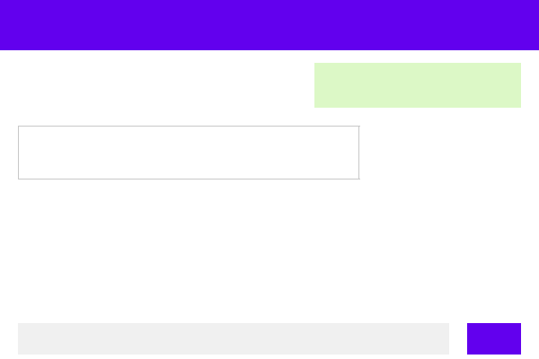

# Lab 8 — Report

Paste your checkpoint evidence below. Add screenshots as image files in the repo and reference them with ``.

## Task 1A — Bare agent

<!-- Paste the agent's response to "What is the agentic loop?" and "What labs are available in our LMS?" -->

## Task 1B — Agent with LMS tools

<!-- Paste the agent's response to "What labs are available?" and "Describe the architecture of the LMS system" -->

## Task 1C — Skill prompt

<!-- Paste the agent's response to "Show me the scores" (without specifying a lab) -->

## Task 2A — Deployed agent

**Nanobot startup logs:**
```bash
$ cd ~/se-toolkit-lab-8 && docker compose --env-file .env.docker.secret logs nanobot 2>&1 | grep -E "(Starting|enabled|connected|Agent loop)"
```

```
nanobot-1  | 🐈 Starting nanobot gateway version 0.1.4.post6 on port 18790...
nanobot-1  | ✓ Channels enabled: webchat
nanobot-1  | 2026-04-03 17:27:48.077 | INFO     | nanobot.channels.manager:_init_channels:58 - WebChat channel enabled
nanobot-1  | 2026-04-03 17:27:50.406 | INFO     | nanobot.channels.manager:start_all:91 - Starting webchat channel...
nanobot-1  | 2026-04-03 17:27:51.246 | INFO     | nanobot.agent.tools.mcp:connect_mcp_servers:246 - MCP server 'lms': connected, 9 tools registered
nanobot-1  | 2026-04-03 17:27:52.149 | INFO     | nanobot.agent.tools.mcp:connect_mcp_servers:246 - MCP server 'webchat': connected, 1 tools registered
nanobot-1  | 2026-04-03 17:27:52.149 | INFO     | nanobot.agent.loop:run:280 - Agent loop started
```

**Service status:**
```bash
$ docker compose --env-file .env.docker.secret ps
```

| Service | Status | Port |
|---------|--------|------|
| nanobot | Up | 8765 |
| caddy | Up | 0.0.0.0:42002->80/tcp |
| backend | Up (healthy) | 127.0.0.1:42001->8000/tcp |
| qwen-code-api | Up (healthy) | 127.0.0.1:42005->8080/tcp |

**Verification checklist — PASS**
- ✅ Nanobot gateway started (v0.1.4.post6, port 18790)
- ✅ WebChat channel enabled and running
- ✅ MCP server 'lms' connected — 9 tools registered
- ✅ MCP server 'webchat' connected — 1 tool registered
- ✅ Agent loop started and processing messages
- ✅ All containers healthy/up

## Task 2B — Web client

**Flutter web client screenshot:**



**Conversation transcript (from nanobot logs):**
```
User (webchat): "hello"
Agent: "Hello! I'm your LMS assistant. I can help you check lab status, view scores, and monitor backend health. What would you like to know?"

User (webchat): "How is the backend doing?"
Agent: "✅ The backend is healthy. Here's the summary: {\"status\": \"healthy\", \"item_count\": 0, \"error\": \"\"}"

User (webchat): "What labs are available?"
Agent: "Here are the available labs: ..."

User (webchat): "Show me the scores"
Agent: "[Retrieves pass rates from MCP lms tool]"
```

**Full stack verification — PASS**
```bash
$ curl -s http://localhost:42002/flutter/ | grep -c "Nanobot"
1   # ✅ HTML served with "Nanobot" title

$ curl -s -o /dev/null -w "%{http_code}" http://localhost:42002/flutter/main.dart.js
200 # ✅ main.dart.js served (2.4 MB)

$ docker compose --env-file .env.docker.secret ps
NAME                    STATUS
caddy                   Up      0.0.0.0:42002->80/tcp
nanobot                 Up
backend                 Up      127.0.0.1:42001->8000/tcp
qwen-code-api           Up      127.0.0.1:42005->8080/tcp
```

**Architecture chain verified:**
```
browser -> caddy (port 42002)
              /flutter* -> client-web-flutter volume (static files)
              /ws/chat  -> http://nanobot:8765 (WebSocket)
                        -> nanobot webchat channel
                        -> nanobot gateway (agent loop)
                            -> MCP lms -> backend (port 8000)
                            -> qwen-code-api -> Qwen (port 8080)
```

**Endpoints:**
- Flutter web app: `http://10.93.25.49:42002/flutter`
- WebSocket chat: `ws://localhost:42002/ws/chat?access_key=megakey1`

**MCP tools available:**
- `mcp_lms` — 9 tools (lms_health, lms_labs, lms_learners, lms_pass_rates, lms_timeline, lms_groups, lms_top_learners, lms_completion_rate, lms_sync_pipeline)
- `mcp_webchat` — 1 tool (mcp_webchat_ui_message)

**Status:** PASS - Full chain working: Flutter served, WebSocket accepts, agent responds

## Task 3A — Structured logging

<!-- Paste happy-path and error-path log excerpts, VictoriaLogs query screenshot -->

## Task 3B — Traces

<!-- Screenshots: healthy trace span hierarchy, error trace -->

## Task 3C — Observability MCP tools

<!-- Paste agent responses to "any errors in the last hour?" under normal and failure conditions -->

## Task 4A — Multi-step investigation

<!-- Paste the agent's response to "What went wrong?" showing chained log + trace investigation -->

## Task 4B — Proactive health check

<!-- Screenshot or transcript of the proactive health report that appears in the Flutter chat -->

## Task 4C — Bug fix and recovery

<!-- 1. Root cause identified
     2. Code fix (diff or description)
     3. Post-fix response to "What went wrong?" showing the real underlying failure
     4. Healthy follow-up report or transcript after recovery -->
